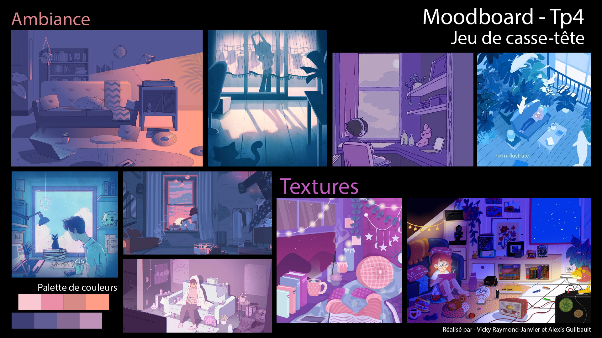

# guilbault_raymond-janvier_tp4_582-301mo
TP4 du projet d'interactivité ludique par Alexis Guilbault et Vicky Raymond-Janvier

## Jeu créé par __Alexis Guilbault__ et __Vicky Raymond-Janvier__.

## Nouveau Jeu
Jeu de casse-tête où le joueur doit choisir les paramètres suivants : Difficulté, image du casse-tête et image du fond. Le jeu sera fait en dessin 2D digitaux **(PAS en pixel art)**. Le casse-tête se fera en échange de tuile : Le joueur devra sélectionner une pièce, et ensuite une autre pour les échanger.

La fonctionnalité principale qui impactera la jouabilité sera le paramétrage de la difficulté (changera le temps alloué pour résoudre le casse-tête ET le nombre de pièce)

Dans ce projet, nous voulons explorer une **diversité esthétique** (les images des puzzles et les différents backgrounds) ainsi que la **manipulation de tableaux** (dans la programmation).

## Moodboard

## Credits
Programmation et Effets Sonores - Alexis Guilbault

Visuels - Vicky Raymond-Janvier

Musique - Raphaël Lefebvre (Originalement de [Corrupted World](https://store.steampowered.com/app/3660270/Corrupted_World/))

## Plateformes
Compaible avec l'arcade en classe

Disponible sur Itch.io : https://voltblade-games.itch.io/cozy-puzzle et via Github Pages : https://alexis-guilbault.github.io/guilbault_raymond-janvier_tp4_582-301mo/
